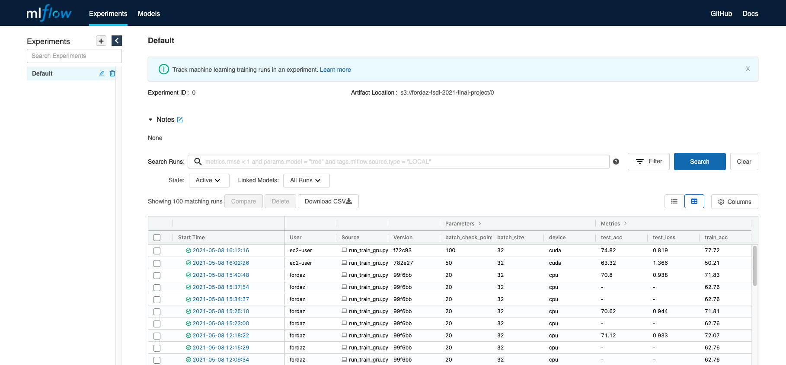
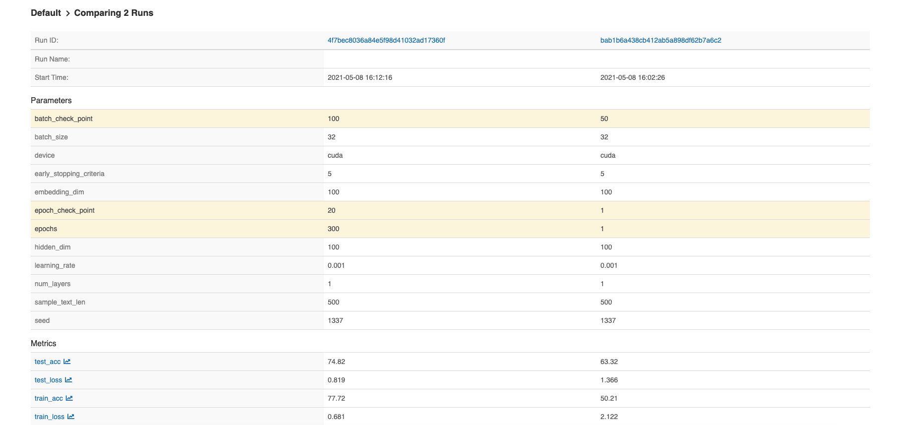

# Synthetic Annotated Document Images

## Full Stack Deep Learning (2021) - Final project.

### Fermin Ordaz

---


# Annotated Document Images

Labor intensive, Slow and Costly

---


- Use the [Form Understanding in Noisy Scanned Documents (FUNSD) dataset](https://guillaumejaume.github.io/FUNSD/)
- Train an Annotation Language Model
- Generate synthetic JSON annotations
- Render annotations info synthetic document images

---

# Machine Learning Approach


The basic architecture is defined as:

- One embedding layer (embedding dimension 100)
- One Gated Recurrent Unit (GRU) layer with a hidden dimension of 100
- One fully connected layer with dropout of 0.5

---

### MLOps Approach

> Equally important: End to end operational aspects such as: Traceability, Repeatability, Automation, Rapid Development and Flexible training (CPU and GPU)

---

### Technology Stack

- Terraform: Infra automation.
- Ansible: Infra configuration and tasks orchestration.
- DVC: Source control for datasets and model artifacts.
- MLFlow: Training tracking, model packaging, model deployment, model service, inference testing.
- Pytorch: Deep Learning Library.
- Sagemaker: AWS Managed service for model inference.

---

### Data Preprocessing

- Convert into single-line JSON "sentences"
- Remove redundant data and reduce sentece length.
- train (5096), validation(2315) and test (2332)


---

### Model Training



---

### Model Training


---

### Model Training


---

### Model Training


---

### Model Training


---

### Model Training



---

### Model Evaluation

- Train Loss (0.681), Validation Loss (0.777) and Test Loss (0.819)
- Train Accuracy (77.72), Validation Accuracy (76.07) and Test Accuracy (74.82)

```
{
   "text": "Incrur:", "box": [255, 737, 356, 868],
   "linking": [], "label": "question", "id": 41
}
{
   "box": [175, 717, 223, 740], "text": "Comer",
   "label": "question", "linking": [[4, 7]], "id": 3
}
{
   "text": "IN TOBIC", "box": [587, 241, 653, 285],
   "linking": [], "label": "header", "id": 7
}
```

---


# Synthetic Annotations

```
   {
      "box": [677, 639, 749, 669], "text": ".44",
      "label": "answer", "linking": [[94, 16]], "id": 35
   },
   {
      "box": [533, 197, 617, 256], "text": "(P2/ 95",
      "label": "answer", "linking": [[31, 3]], "id": 3
   },
```

---


# Synthetic Annotations

```
   {
      "text": "Code Speciop", "box": [49, 975, 160, 799],
      "linking": [], "label": "question", "id": 28
   },
   {
      "box": [121, 59, 252, 25], "text": "02328620",
      "label": "question", "linking": [[5, 47]], "id": 5
   }
```

---

# Inference Demo
